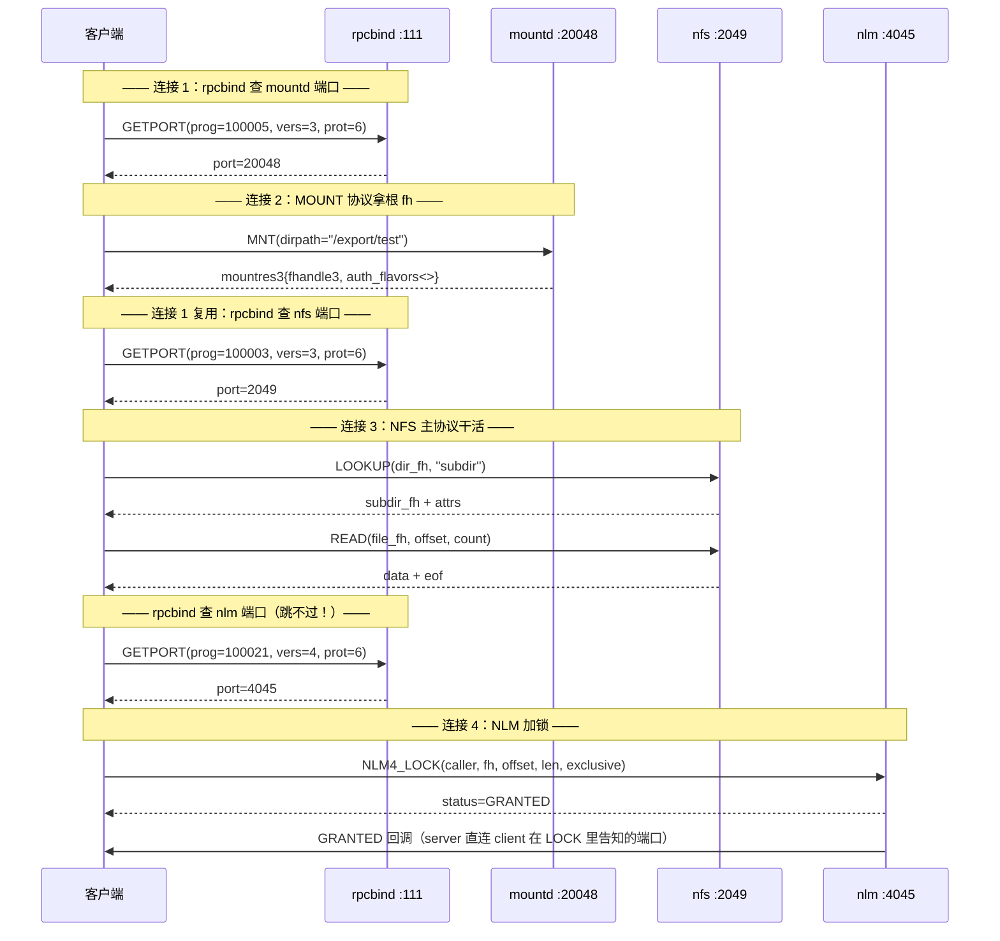
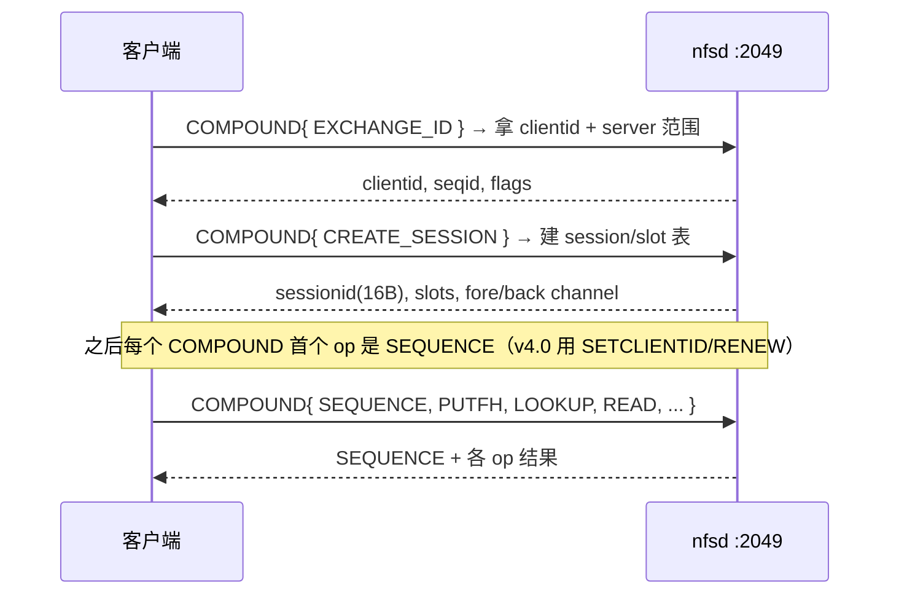
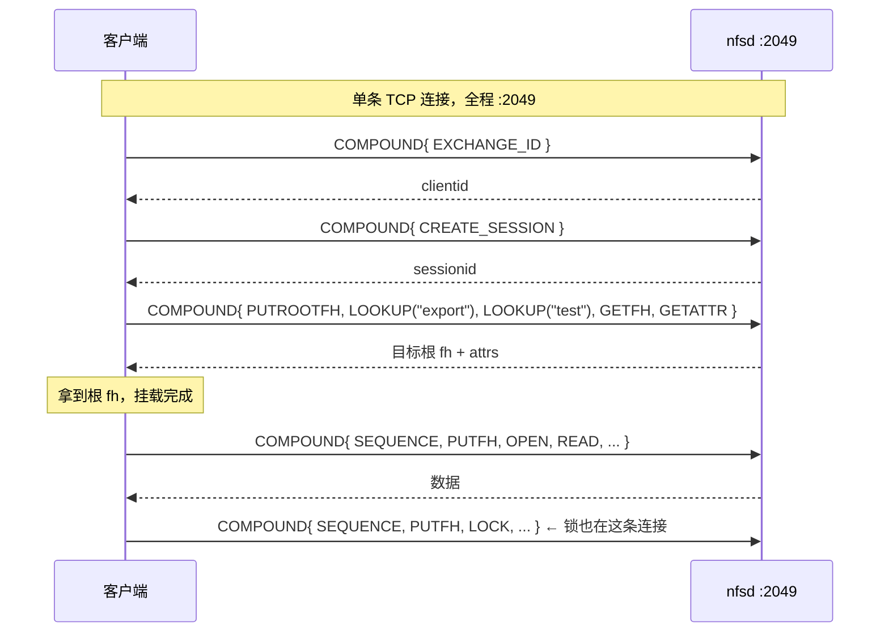

# 一条 `mount` 命令按下去的那一瞬，到底发生了什么？

> 一条 `mount -t nfs server:/export/test /mnt` 命令背后，到底发生了多少次 RPC？为什么 v3 要先问 `:111`，v4 却直连 `:2049`？两种设计哲学碰撞了二十年，各自留下了什么？
>
> 本文从协议字节级拆解 NFS v3 与 v4 的挂载全过程——底座 Sun RPC、rpcbind 端口发现、v3 的六步挂载、v4 的单端口重构。

---

## 底座：Sun RPC 与 rpcbind 端口映射

### rpcbind 是 RPC 生态的"电话簿"

NFS 跑在 **Sun RPC（ONC RPC, RFC 5531）** 之上。Sun RPC 有一个反直觉的特性：**除 rpcbind（`:111`）和 nfs（`:2049`）外，其它 RPC 服务的端口都不固定**——服务端启动时把自己的端口"注册"到 rpcbind，客户端用时再"查"。

rpcbind 自己也是一个 RPC 服务：**程序号 `100000`，固定端口 `111`**。NFS 服务端启动时，各守护进程把自己用的端口注册到 rpcbind：

- `nfsd`（程序号 `100003`）注册"我在 `2049`"
- `rpc.mountd`（程序号 `100005`）注册"我在 `20048`"（或别的端口，看配置）
- `lockd`/NLM（程序号 `100021`）注册"我在 `4045`"（内核参数固定）

客户端不知道这些端口，只会在 `:111` 问一句"我要找 mountd（100005），它在哪个端口？"，rpcbind 回答"在 20048"，客户端才去连 `20048`。

| 程序号 | 名称 | 服务 | 默认端口 | 固定方式 |
|--------|------|------|---------|---------|
| 100000 | rpcbind/portmapper | 端口映射 | 111 | RFC 规定 |
| 100003 | nfs | NFS 文件服务 | 2049 | nfsd 固定 |
| 100005 | mountd | 挂载守护 | 动态 | `MOUNTD_PORT=20048` |
| 100021 | nlockmgr (NLM) | 文件锁 | 动态 | 内核参数 `lockd.nlm_tcpport` |
| 100024 | status (NSM) | 状态监控 | 动态 | `STATD_PORT` |

### 三个版本：PMAP v2 GETPORT vs rpcbind v3/v4 GETADDR

RFC 1833 定义了三个版本的查找服务，都跑在程序号 `100000`、端口 `111`：

| 版本 | 协议名 | 查询过程 | 参数 | 返回 |
|------|--------|---------|------|------|
| 2 | Port Mapper | `GETPORT` (proc 3) | `{prog, vers, prot, port}`（prot 是 IP 协议号：6=TCP, 17=UDP） | `u32` 端口号 |
| 3 | rpcbind v3 | `GETADDR` (proc 3) | `{prog, vers, netid, uaddr, owner}`（netid 是字符串） | 通用地址字符串 |
| 4 | rpcbind v4 | `GETADDR` + 扩展 | 同 v3 | 同 v3 + 多地址列表 |

v2 用 IP 协议号硬编码传输，v3/v4 用字符串 `netid`（`"tcp"`/`"udp"`/`"tcp6"`）做到传输无关。返回的 **universal address (uaddr)** 格式：IPv4 为 `A.B.C.D.p.q`，其中 `p.q` 是 16 位端口的大端两字节——例如端口 `2049` → `0x0801` → `8.1`，完整 uaddr `192.168.1.1.8.1`。

> **关键差异**：PMAP GETPORT 的参数里 `prot` 是 IP 协议号（6=TCP）；rpcbind GETADDR 的参数里 `netid` 是字符串。现代 `rpcinfo` 默认发 v4 GETADDR，老工具发 v2 GETPORT。

---

## NFSv3 mount 全过程

### 全景时序

v3 的一次完整挂载其实是 **"问端口 → 拿句柄 → 干活"** 三步，外加文件锁时还要再多问一次端口。细化到字节级，一次带锁的完整 mount 是 **6 步 RPC、4 条独立 TCP 连接**：



### 第一步：GETPORT 找 mountd

客户端先连 `:111`，发一条 rpcbind v2 `GETPORT`（或 v3/v4 `GETADDR`）。PMAP v2 的参数是 `{prog, vers, prot, port}`——客户端要查 mountd 就填 `{100005, 3, 6, 0}`（prot=6=TCP）。rpcbind 回一个 `u32` 端口号 `20048`。

> 字节级：整条 GETPORT CALL 经 RM 头封装后大约 56 字节。`xid(4) + mtype=0(4) + rpcvers=2(4) + prog=100000(4) + vers=2(4) + proc=3(4) + cred(8+) + verf(8) + args{prog=100005, vers=3, prot=6, port=0}(16)`。

### 第二步：MOUNT MNT 拿根 file handle

拿到 `20048` 后，客户端新开一条 TCP 连到 `:20048`，发 MOUNT 协议的 `MNT`（proc 1）。参数只有一个 `dirpath` 字符串（如 `"/export/test"`）。`rpc.mountd` 做两步鉴权：**路径匹配**（查 `/etc/exports` 经 `exportfs` 编译的 `/var/lib/nfs/etab`）+ **IP 鉴权**（查访问控制列表）。成功返回 `mountres3_ok`：

- `fhandle3 fhandle` —— NFSv3 文件句柄（最多 64 字节），客户端拿它做后续所有 NFS LOOKUP/READ
- `int auth_flavors<>` —— 服务端支持的认证方式数组（`AUTH_UNIX=1`、`AUTH_SYS=1` 等）

**这一步是 v3 mount 的本质**：客户端拿到的 `fhandle3` 就是它在 NFS 命名空间里的"根钥匙"。注意此时还没有碰过 `:2049`——MOUNT 协议（`100005`）和 NFS 协议（`100003`）是两个独立的 RPC 程序，跑在不同端口、不同 TCP 连接上。

### 第三步：GETPORT 找 nfs

拿到根 fh 后，客户端还要知道 nfsd 在哪。再问 `:111`：`GETPORT(100003, 3, 6)` → `2049`。这一步可以用 mount 选项 `-o port=2049` 跳过（直接告诉客户端 nfs 在 2049，不查 rpcbind）。

### 第四步：用 fh 干活

连 `:2049`，发 NFSv3 过程。**所有后续操作都建立在 MNT 返回的根 fh 之上**：`LOOKUP(根fh, "subdir")` → 拿 subdir fh → `READ(subdir_fh, offset, count)` → 数据。这就是为什么 v3 必须先 MOUNT 再 NFS——没有 fh 你连第一个 LOOKUP 都发不出来。

### 第五步：NLM 锁——跳不过的 rpcbind

如果应用要加文件锁（`fcntl` / `flock`），客户端还要查 NLM 端口：`GETPORT(100021, 4, 6)` → `4045`，再连 `:4045` 发 `NLM4_LOCK`。

**这里有个容易踩的坑**：mount 选项 `port=` / `mountport=` 只能把 nfs（100003）和 mountd（100005）的端口直接告诉客户端，让它跳过对这两个程序的 GETPORT。但 **没有 mount 选项能指定 NLM server 端口**——NLM 端口只能在 server 侧用内核参数 `options lockd nlm_tcpport=4045` 固定，且客户端**仍要查 server rpcbind `GETPORT(100021)` 才能发现它**，不能像 nfs/mountd 那样 `-o` 写死直连。

所以"完全跳过 rpcbind"在 v3 + 文件锁场景下 **不成立**。

> **NLM 回调机制**：client 在 `NLM4_LOCK` 请求参数里把自己的回调地址（IP+端口）告诉 server，server 授予锁时**直连**该地址回调 `GRANTED`（不查 client rpcbind）。client 的 nlm 回调端口默认动态分配并注册本机 rpcbind，可用 `nlm_tcpport` 内核参数固定。

---

## NFSv4 mount 全过程

### v4 的简化：单端口 + 无 mountd

NFSv4.0（RFC 7530）是重大重构。对照 v3，v4 把"挂载"这件事彻底内化进 NFS 主协议：

| 维度 | NFSv3 | NFSv4 |
|------|-------|-------|
| RPC 端口 | `2049` + `20048` + `4045` + `111` | **仅 `2049`** |
| 协议数量 | NFS + MOUNT + NLM + rpcbind | 单一 NFS 协议 |
| RPC 过程数 | 22 个独立过程 | 2 个（NULL + COMPOUND） |
| 挂载 | 独立 MOUNT 协议 `MNT` 返回根 fh | COMPOUND 内 `PUTROOTFH + LOOKUP` |
| 锁 | 独立 NLM 协议 | 内建 `LOCK`/`LOCKT`/`LOCKU` op |
| 状态 | 无状态 | 有状态（clientid/stateid/session） |
| rpcbind 查询 | 必需 | **不需要** |

客户端 `mount -t nfs -o vers=4 server:/export/test /mnt` 时，**直接 TCP 连 `server:2049`**，不发任何 GETPORT。

### session 建立（v4.1+）

NFSv4.1（RFC 5661）引入 session。客户端连上 `:2049` 后，先建立会话：



> v4.0 没有 session，用 `SETCLIENTID` + `SETCLIENTID_CONFIRM` + `RENEW` 维持 clientid；v4.1+ 用 `EXCHANGE_ID` + `CREATE_SESSION`，续租由每次 COMPOUND 的 `SEQUENCE` op 隐式完成。服务器定义 `lease_time`（默认 90s），超时回收该 clientid 的所有 state。

### `PUTROOTFH + LOOKUP` 替代 `MOUNT MNT`

v4 没有 MOUNT 协议，"挂载"就是 COMPOUND 里一串文件句柄操作。关键在 **`PUTROOTFH`（op 21）**：它把服务器的"当前 FH"设为伪根（`fsid=0`）。服务端导出配置要显式标一个伪根：

```
# /etc/exports (NFSv4)
/             *(rw,fsid=0,no_root_squash,insecure,crossmnt)   ← 伪根
/export/test  *(rw,no_root_squash,insecure)
```

客户端挂载 `server:/export/test` 时发的第一个 COMPOUND 大致是：

```
COMPOUND {
    PUTROOTFH              // 当前 FH = 伪根 "/"  (fsid=0)
    LOOKUP("export")       // 在伪根下查 "export" → 当前 FH = /export
    LOOKUP("test")         // 查 "test"          → 当前 FH = /export/test
    GETFH                  // 取回当前 FH = 目标根 fh
    GETATTR(bitmap)        // 顺带取属性
}
```

`PUTROOTFH` + 一串 `LOOKUP` 就等于 v3 的 `MOUNT MNT`——都是"拿到目标路径的根 file handle"。区别是 v4 全部封装在一条 COMPOUND RPC 里（一个 XID），而 v3 是独立的 MOUNT 协议 RPC（另一个 XID、另一个端口、另一条连接）。

### COMPOUND 结构

```c
struct COMPOUND4args {
    utf8str_cs   tag;           /* 调用方标签（调试用） */
    uint32       minorversion;  /* 0=v4.0, 1=v4.1, 2=v4.2 */
    nfs_argop4   argarray<>;    /* 操作数组：opcode + per-op args */
};
struct COMPOUND4res {
    nfsstat4     status;        /* 整体状态（最后一个 op 的） */
    utf8str_cs   tag;
    nfs_resop4   resarray<>;    /* 结果数组，与 argarray 一一对应 */
};
```

**规则**：操作按序执行；任一 op 失败（status ≠ NFS4_OK），后续 op 不再执行。

### 内建 LOCK 替代 NLM

v4 的文件锁不再是独立协议，而是 COMPOUND 里的 op：

```
COMPOUND { PUTFH(file_fh), OPEN(..., access=READ|WRITE) → open_stateid,
           LOCK(open_stateid, lockowner, READ_LT, offset, length) }
// 释放
COMPOUND { PUTFH(file_fh), LOCKU(lock_stateid, offset, length), CLOSE(open_stateid) }
```

所以 v4 的"挂载 + 加锁"全程不碰 `:111`、不碰 `:20048`、不碰 `:4045`——**一切都在 `:2049` 的 COMPOUND 里**。这也是 v4 对防火墙友好的根本原因：只开一个端口。

### v4 mount 时序



---

## 全景对比

| 维度 | NFSv3 | NFSv4 |
|------|-------|-------|
| 入口端口 | `:111`(rpcbind) → `:20048`(mountd) → `:2049`(nfs) [+ `:4045`(nlm)] | **仅 `:2049`** |
| rpcbind 查询 | 必需（nfs/mountd/nlm 端口发现） | **不需要** |
| 挂载协议 | 独立 MOUNT v3（prog 100005），`MNT` 返回根 `fhandle3` | COMPOUND 内 `PUTROOTFH + LOOKUP`，伪根 `fsid=0` |
| 根 fh 来源 | `rpc.mountd`（用户态） | `nfsd`（内核线程，`PUTROOTFH`） |
| 锁 | 独立 NLM v4（prog 100021），`NLM4_LOCK` + GRANTED 回调 | 内建 `LOCK`/`LOCKT`/`LOCKU` op |
| 状态 | 无状态 | 有状态（clientid/stateid，v4.1+ session） |
| 一次 mount 的 RPC 数 | 4–6 个独立 RPC（含锁） | 2–3 个 COMPOUND（每个含多 op） |
| TCP 连接数 | 3–4 条（rpcbind/mountd/nfs/nlm） | **1 条** |
| 防火墙友好度 | 差（多动态端口） | 好（单端口） |
| `-o` 跳过 rpcbind | 部分可（`port=`/`mountport=`），NLM 跳不过 | 不需要跳（本就不查） |

---

### 参考与延伸

- 协议基础：RFC 5531（RPC）、RFC 4506（XDR）、RFC 1833（rpcbind）
- NFSv3：RFC 1813
- NFSv4：RFC 7530（v4.0）、RFC 5661（v4.1）、RFC 7862（v4.2）
