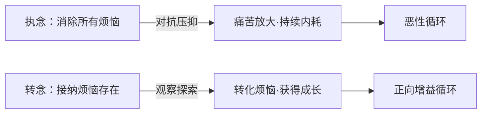
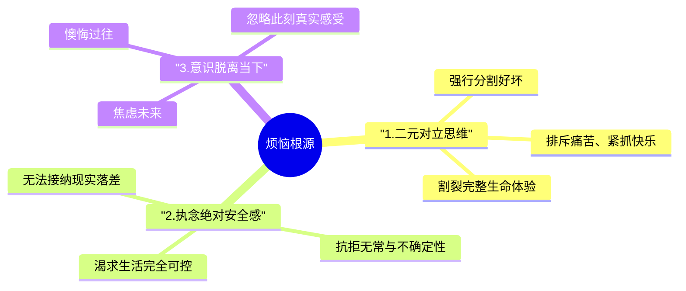
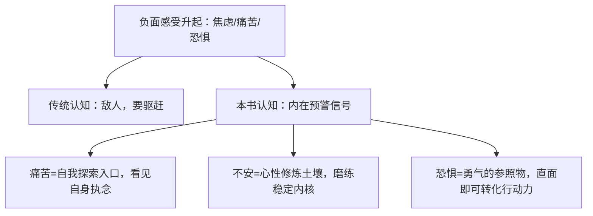
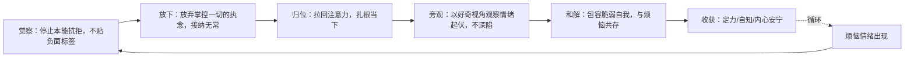
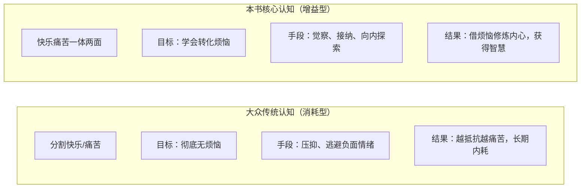
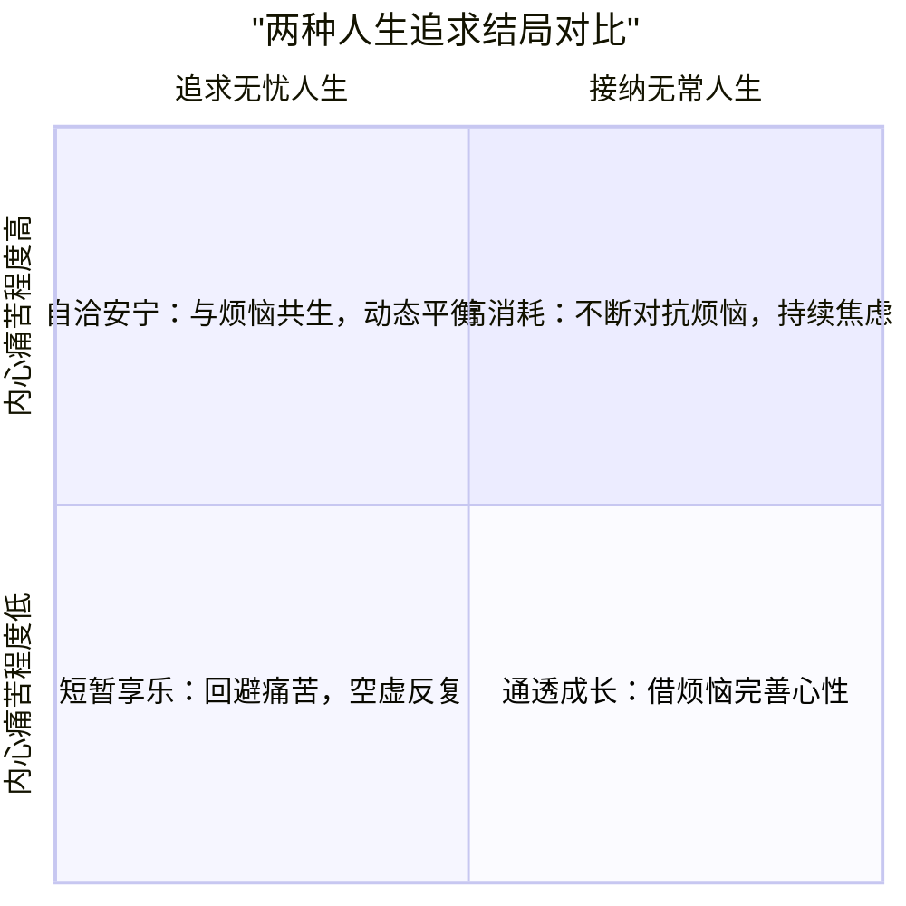

# 《如何从烦恼中获益》完整核心思想手册
> 作者：阿兰·瓦兹
> 核心主旨：不消灭烦恼，转化烦恼、从痛苦中获得心灵成长与智慧

## 目录
1. 全书总纲：反向获益定律
2. 烦恼产生三大根源逻辑图
3. 烦恼的本质：心灵信号模型
4. 五步转化实操流程（Mermaid流程图）
5. 二元对立认知对比图
6. 最终人生智慧总结
7. 落地实践要点

---

## 一、全书总纲：反向获益定律
### 核心论断
烦恼、焦虑、痛苦无法彻底根除；强行对抗只会加剧内耗。
快乐与痛苦一体共生，接纳烦恼、顺势觉察，方能将负面情绪转化为内在定力、自知、勇气。
底层融合东方禅学、道家「反者道之动」与现代情绪心理学。

---

## 二、烦恼产生三大根源

### 文字简述
1. 二元对立：人为划分情绪好坏，排斥负面感受，制造内心撕裂；
2. 控制执念：世界本无常，对安稳、完美的过高期待是焦虑源头；
3. 思维飘移：大脑长期游离过去未来，脱离当下，持续制造精神消耗。

---

## 三、烦恼的本质：心灵预警信号模型

### 核心解读
烦恼不是灾祸，是内心在向你发出提醒：
你的执念、欲望、认知盲区正在制造痛苦；顺信号向内探索，就能从中获益。

---

## 四、转化烦恼五步实操流程（核心行动框架）

### 每步简要说明
1. **觉察**：不对烦恼产生厌恶、逃避，单纯看见情绪；
2. **放下**：接受人生本就不完美，不必强求事事顺心；
3. **归位**：停止追忆、预判，专注眼前人、事、物；
4. **旁观**：把情绪当作客观现象观察，减少自我卷入；
5. **和解**：不再批判脆弱的自己，建立内心包容力。

---

## 五、两种认知模式对比（二元对立 VS 整体接纳）

---

## 六、全书最终人生智慧

### 三条终极结论
1. 不存在永久无烦恼的人生，追求无痛本身就是痛苦来源；
2. 生命圆满不靠消除苦难，靠拥有转化困境、觉察自我的能力；
3. 放下对外在完美的执念，安住当下，获得长久心灵自由。

---

## 七、日常落地实践要点
1. 烦恼升起第一秒，先停顿觉察，不立刻发泄或逃避；
2. 每当感到烦躁焦虑，反问自己：这份烦恼在提醒我什么执念？
3. 减少对未来的过度规划与对过往的反复复盘，每日留出「当下专注时刻」；
4. 允许自己有负面情绪，不自我攻击，包容自身所有感受；
5. 长期练习：把每一次烦恼都当作一次心性修行的机会。

---

## 一句话极简总述
《如何从烦恼中获益》认为烦恼是生命不可分割的一部分，对抗只会加剧痛苦；通过觉察、接纳、回归当下、旁观和解五步心法，可将焦虑、痛苦转化为自知、定力与勇气，在无常世界中实现长久内心自洽。

## 使用说明
1. 直接复制上方全部内容，保存为 `如何从烦恼中获益-核心总结.md`；
2. 支持 Typora、Obsidian、VS Code、Notion 等主流 Markdown 编辑器；
3. 所有 mermaid 图表在开启渲染的编辑器中会自动生成思维导图、流程图、四象限图；
4. 结构分层清晰，可直接复制单独某一章节、图表复用。

需要我帮你把这份内容精简成一页极简便携版 MD 吗？